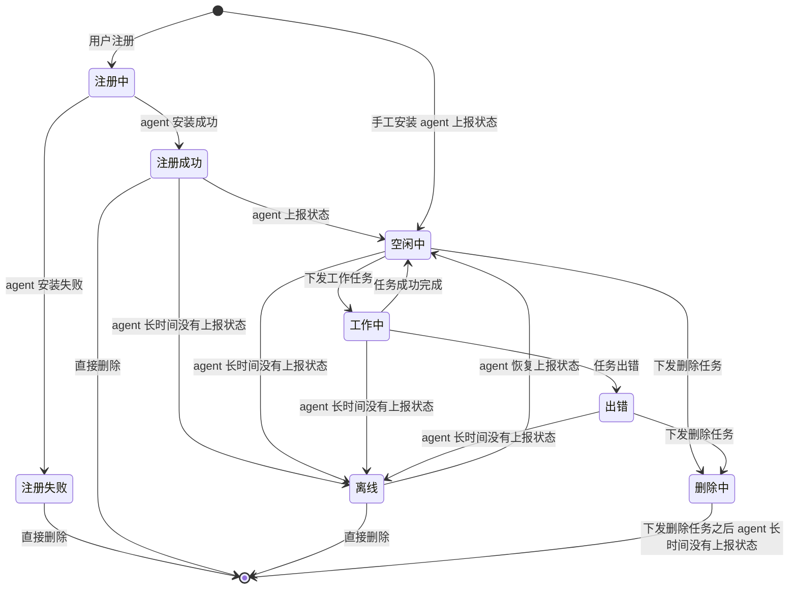

场景：
有一个服务端和若干个客户端机器，客户端可以主动和服务端建立连接，服务端不一定能主动和客户端建立连接

当客户端和服务端建立连接后，服务端可以给客户端下发任务，客户端执行任务并上报状态

```mermaid
stateDiagram-v2
s1: 注册中
s2: 注册失败
s3: 注册成功
s4: 空闲中
s5: 工作中
s6: 出错
s7: 离线
s8: 删除中

[*] --> s1: 用户注册
s1 --> s2: agent 安装失败
s1 --> s3: agent 安装成功
s3 --> s4: agent 上报状态
[*] --> s4: 手工安装 agent 上报状态
s4 --> s5: 下发工作任务
s5 --> s6: 任务出错
s3 --> s7: agent 长时间没有上报状态
s4 --> s7: agent 长时间没有上报状态
s5 --> s7: agent 长时间没有上报状态
s6 --> s7: agent 长时间没有上报状态
s7 --> s4: agent 恢复上报状态
s5 --> s4: 任务成功完成
s2 --> [*]: 直接删除
s3 --> [*]: 直接删除
s7 --> [*]: 直接删除

s4 --> s8: 下发删除任务
s6 --> s8: 下发删除任务

s8 --> [*]: 下发删除任务之后 agent 长时间没有上报状态

```
